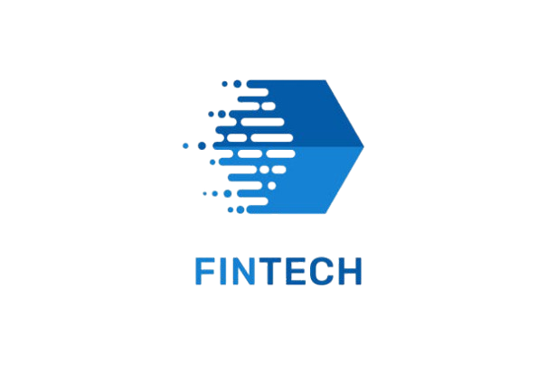

# 📱 MSME Pathways - Mobile Application

<div align="center">



**Smart Loan Support for the Informal Sector**

[](https://flutter.dev)
[](https://dart.dev)
[](LICENSE)
[](https://github.com/yourusername/msme-pathways-mobile)

*Empowering Filipino Microentrepreneurs Through AI-Powered Financial Inclusion*

[Features](#-features) • [Screenshots](#-screenshots) • [Installation](#-installation) • [Architecture](#-architecture) • [Contributing](#-contributing)

</div>

---

## 📖 About The Project

**MSME Pathways** is an AI-enabled, blockchain-integrated mobile application designed to promote financial inclusion among informal-sector microentrepreneurs in the Philippines. The app provides accessible financial education, ethical loan pre-screening, and alternative data-driven profiling to help users understand and access formal lending opportunities.

### 🎯 Target Users
- 🏪 Sari-sari store owners
- 🛒 Market vendors and stallholders
- 🏡 Home-based sellers
- 👥 Microentrepreneurs with limited or no access to formal credit

### 🌟 Key Highlights
- **AI-Powered Chatbot** - Financial guidance in simple Tagalog
- **Alternative Data Profiling** - No credit history required
- **Blockchain Security** - Transparent and immutable transaction records
- **Financial Education** - Interactive loan literacy modules
- **Smart Pre-qualification** - Ethical loan readiness assessment

---

## ✨ Features

### 🤖 AI Financial Guidance
- Conversational chatbot explaining loan concepts in Tagalog
- Natural language processing for easy interaction
- Personalized financial education based on user profile

### 📊 Smart Profiling & Assessment
- Alternative data collection (business activity, income patterns)
- Intelligent loan readiness scoring
- Personalized recommendations and feedback

### 📚 Loan Education Modules
- Interactive lessons on interest rates, terms, and repayment
- Simplified explanations with real-world examples
- Progress tracking and quizzes

### 🔒 Blockchain Integration
- Secure transaction verification using Solidity smart contracts
- Immutable record of user verification events
- Transparent lending process

### 🌐 Multi-language Support
- Filipino (Tagalog) - Primary
- English - Secondary

### 📱 User-Friendly Interface
- Clean, minimal design
- Culturally relevant imagery
- Optimized for users with varying digital literacy

---


---

## 🛠️ Built With

### **Core Technologies**
- [Flutter](https://flutter.dev) - UI framework
- [Dart](https://dart.dev) - Programming language
- [Provider](https://pub.dev/packages/provider) - State management
- [Go Router](https://pub.dev/packages/go_router) - Navigation

### **AI & Machine Learning**
- TensorFlow Lite - On-device ML inference
- Natural Language Processing - Chatbot intelligence
- Alternative data profiling algorithms

### **Blockchain**
- Solidity - Smart contract development
- Web3Dart - Ethereum blockchain interaction
- Polygon Network - Layer 2 solution for low fees

### **UI/UX Libraries**
- Google Fonts - Typography
- Lucide Icons - Icon system
- Flutter Animate - Smooth animations
- Smooth Page Indicator - Onboarding indicators

### **Backend Integration**
- Dio - HTTP client
- Shared Preferences - Local storage
- Flutter Secure Storage - Sensitive data encryption

---

## 🏗️ Architecture

This project follows **MVVM (Model-View-ViewModel)** architecture pattern with clean code principles.

```
lib/
├── main.dart                          # App entry point
├── app.dart                           # MaterialApp configuration
│
├── core/
│   ├── constants/                     # App-wide constants
│   ├── theme/                         # Theme configuration
│   ├── utils/                         # Utility functions
│   └── services/                      # Core services (API, Storage, Navigation)
│
├── data/
│   ├── models/                        # Data models (User, Loan, etc.)
│   ├── repositories/                  # Data layer abstraction
│   └── data_sources/                  # API clients, local storage
│
├── presentation/
│   ├── viewmodels/                    # Business logic layer
│   ├── views/                         # UI screens
│   │   ├── splash/
│   │   ├── onboarding/
│   │   ├── auth/
│   │   ├── home/
│   │   ├── chatbot/
│   │   ├── loan/
│   │   └── profile/
│   └── widgets/                       # Reusable UI components
│
└── routes/                            # Navigation configuration
```

### **Design Patterns Used**
- ✅ MVVM (Model-View-ViewModel)
- ✅ Repository Pattern
- ✅ Dependency Injection
- ✅ Observer Pattern (via ChangeNotifier)
- ✅ Singleton Pattern (for services)

---

## 🚀 Getting Started

### Prerequisites

Before you begin, ensure you have the following installed:

- **Flutter SDK** (3.19.0 or later)
  ```bash
  flutter --version
  ```
- **Dart SDK** (3.3.0 or later)
- **Android Studio** or **VS Code** with Flutter extensions
- **Git**

### Installation

1. **Clone the repository**
   ```bash
   git clone https://github.com/yourusername/msme-pathways-mobile.git
   cd msme-pathways-mobile
   ```

2. **Install dependencies**
   ```bash
   flutter pub get
   ```

3. **Configure environment variables**
   
   Create a `.env` file in the root directory:
   ```env
   API_BASE_URL=https://api.msmepathways.ph
   BLOCKCHAIN_RPC_URL=https://polygon-rpc.com
   SMART_CONTRACT_ADDRESS=0x...
   ```

4. **Run the app**
   
   For Android:
   ```bash
   flutter run
   ```
   
   For iOS:
   ```bash
   flutter run -d ios
   ```

5. **Build for production**
   
   Android APK:
   ```bash
   flutter build apk --release
   ```
   
   iOS:
   ```bash
   flutter build ios --release
   ```

---

## 📋 Requirements

### **Minimum System Requirements**

#### Android
- Android 9.0 (API level 28) or higher
- 2 GB RAM minimum
- 100 MB free storage

#### iOS
- iOS 13.0 or later
- iPhone 6s or newer
- 100 MB free storage

### **Permissions Required**
- 📶 Internet access
- 📸 Camera (for document scanning - optional)
- 📁 Storage (for profile pictures - optional)
- 🔔 Notifications

---

## 🧪 Testing

### Run unit tests
```bash
flutter test
```

### Run widget tests
```bash
flutter test test/widget_test.dart
```

### Run integration tests
```bash
flutter test integration_test/app_test.dart
```

### Code coverage
```bash
flutter test --coverage
genhtml coverage/lcov.info -o coverage/html
```

---

## 📦 Project Dependencies

### **Main Dependencies**
```yaml
dependencies:
  flutter:
    sdk: flutter
  
  # State Management
  provider: ^6.1.1
  
  # Navigation
  go_router: ^13.0.0
  
  # Networking
  dio: ^5.4.0
  
  # Local Storage
  shared_preferences: ^2.2.2
  flutter_secure_storage: ^9.0.0
  
  # UI/UX
  google_fonts: ^6.1.0
  flutter_animate: ^4.5.0
  smooth_page_indicator: ^1.1.0
  lucide_icons: ^0.0.1
  
  # Blockchain
  web3dart: ^2.7.1
  
  # Utils
  intl: ^0.18.1
  url_launcher: ^6.2.2
```

### **Dev Dependencies**
```yaml
dev_dependencies:
  flutter_test:
    sdk: flutter
  flutter_lints: ^3.0.0
  build_runner: ^2.4.7
  mockito: ^5.4.4
```

---

## 🗂️ Folder Structure Details

### **Core Layer**
Contains app-wide configurations, constants, and services.

```
core/
├── constants/
│   ├── api_constants.dart        # API endpoints
│   ├── app_colors.dart           # Color palette
│   ├── app_text_styles.dart      # Typography
│   └── string_constants.dart     # Static strings
├── theme/
│   └── app_theme.dart            # Light/dark theme
├── utils/
│   ├── validators.dart           # Form validators
│   └── formatters.dart           # Number/date formatters
└── services/
    ├── api_service.dart          # HTTP client wrapper
    ├── storage_service.dart      # Local storage
    └── navigation_service.dart   # Navigation helper
```

### **Data Layer**
Handles data models, repositories, and data sources.

```
data/
├── models/
│   ├── user_model.dart
│   ├── loan_model.dart
│   └── chatbot_message_model.dart
├── repositories/
│   ├── auth_repository.dart
│   ├── user_repository.dart
│   └── loan_repository.dart
└── data_sources/
    ├── remote/
    │   └── api_client.dart
    └── local/
        └── local_storage.dart
```

### **Presentation Layer**
Contains UI, business logic, and reusable widgets.

```
presentation/
├── viewmodels/
│   ├── splash_viewmodel.dart
│   ├── auth_viewmodel.dart
│   └── home_viewmodel.dart
├── views/
│   ├── splash/
│   ├── onboarding/
│   ├── auth/
│   └── home/
└── widgets/
    ├── common/
    └── custom/
```

---

## 🎨 Color Scheme

Based on the MSME Pathways logo:

```dart
// Primary Colors
const Color primaryBlue = Color(0xFF1565C0);    // Trust & Stability
const Color primaryYellow = Color(0xFFFFC107);  // Opportunity
const Color accentRed = Color(0xFFE53935);      // Energy & Action

// Neutral Colors
const Color darkBg = Color(0xFF1A1A1A);
const Color lightBg = Color(0xFFF5F5F5);
const Color white = Color(0xFFFFFFFF);

// Gradients
const Gradient primaryGradient = LinearGradient(
  colors: [Color(0xFF1565C0), Color(0xFF0D47A1)],
);
```

---

## 🤝 Contributing

We welcome contributions from the community! Here's how you can help:

### **How to Contribute**

1. **Fork the repository**
2. **Create a feature branch**
   ```bash
   git checkout -b feature/AmazingFeature
   ```
3. **Commit your changes**
   ```bash
   git commit -m 'Add some AmazingFeature'
   ```
4. **Push to the branch**
   ```bash
   git push origin feature/AmazingFeature
   ```
5. **Open a Pull Request**

### **Code Style Guidelines**
- Follow [Effective Dart](https://dart.dev/guides/language/effective-dart) guidelines
- Use `dartfmt` for formatting
- Write meaningful commit messages
- Add comments for complex logic
- Write unit tests for new features

### **Reporting Bugs**
- Use the GitHub Issues tab
- Provide detailed description
- Include steps to reproduce
- Attach screenshots if applicable

---

## 📄 License

This project is licensed under the **MIT License** - see the [LICENSE](LICENSE) file for details.

---

## 👥 Team

**MSME Pathways Development Team**

| Name | Role | GitHub |
|------|------|--------|
| Justin Mc Neal Caronongan | Project Manager | [@justincaronongan](https://github.com/justincaronongan) |
| Eli Gabriel Soriano | System Developer | [@eligabrielsoriano](https://github.com/eligabrielsoriano) |
| John Loyd Pimentel | Researcher | [@johnloydpimentel](https://github.com/johnloydpimentel) |
| Feniel Barte | Document Writer | [@fenielbarte](https://github.com/fenielbarte) |
| Joshua Co | System Designer | [@joshuaco](https://github.com/joshuaco) |

---

## 📞 Contact & Support

- **Email**: support@msmepathways.ph
- **Website**: [www.msmepathways.ph](https://www.msmepathways.ph)
- **Facebook**: [MSME Pathways](https://facebook.com/msmepathways)
- **Issues**: [GitHub Issues](https://github.com/yourusername/msme-pathways-mobile/issues)

---

## 🙏 Acknowledgments

- **PHINMA - University of Pangasinan** - For academic support
- **DTI Philippines** - For MSME statistics
- **Our Target Users** - Sari-sari store owners, vendors, and microentrepreneurs who provided valuable feedback

---

## 📊 Project Status

**Current Version**: v1.0.0 (Beta)

- ✅ Splash Screen
- ✅ Onboarding Flow
- ✅ Authentication (Login/Signup)
- ✅ AI Chatbot
- ✅ Loan Education Modules
- ✅ Alternative Data Profiling
- ✅ Blockchain Integration
- 🚧 Admin Dashboard (In Progress)
- 📋 User Analytics (Planned)

---

## 🗺️ Roadmap

### **Phase 1: MVP (Completed)**
- ✅ Core app structure with MVVM
- ✅ User authentication
- ✅ AI chatbot implementation
- ✅ Basic profiling features

### **Phase 2: Beta Testing (Current)**
- 🚧 Usability testing with actual users
- 🚧 Bug fixes and performance optimization
- 🚧 UI/UX refinements

### **Phase 3: Production (Q2 2026)**
- 📋 Integration with microfinance partners
- 📋 Advanced analytics and reporting
- 📋 Multi-language support expansion
- 📋 iOS App Store release

### **Phase 4: Scale (Q3 2026)**
- 📋 Regional expansion
- 📋 Partnership with government agencies
- 📋 Enhanced AI capabilities
- 📋 Offline mode support

---

## 📚 Documentation

For more detailed documentation, please visit:

- [API Documentation](docs/API.md)
- [User Guide](docs/USER_GUIDE.md)
- [Developer Guide](docs/DEVELOPER_GUIDE.md)
- [Architecture Overview](docs/ARCHITECTURE.md)
- [Blockchain Integration](docs/BLOCKCHAIN.md)

---

## ⚠️ Disclaimer

This application is a research and development project for academic purposes. It does not provide actual loan disbursement or financial advisory services. Users should consult licensed financial professionals for formal lending decisions.

---

<div align="center">

**Made with ❤️ by the MSME Pathways Team**

**Empowering Filipino Microentrepreneurs, One Loan at a Time** 🇵🇭

[](https://github.com/yourusername/msme-pathways-mobile)
[](https://github.com/yourusername/msme-pathways-mobile/fork)

</div>